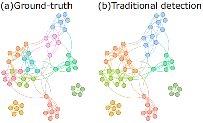

# Machine Learning Informed by Statistical Physics for Community Detection

This repository contains the code accompanying the paper **"Machine Learning Informed by Micro and Mesoscopic Statistical Physics Methods for Community Detection."**

We combine machine learning techniques with micro- and mesoscopic statistical physics insights to enhance the performance of community detection tasks.

This paper has been accepted by *Chaos: An Interdisciplinary Journal of Nonlinear Science* and will be published soon.  
The DOI is [10.1063/5.0268930](https://doi.org/10.1063/5.0268930) (currently pending activation).  
The preprint is available at:  
[**arXiv:2504.13538**](https://arxiv.org/abs/2504.13538)

---

## 📂 Project Structure

- `norm_dataset/`  
  Contains the input data, including six network files used for training and evaluation.

- `main.py`  
  Main entry point of the project.

- `main.py`  
  Main entry point of the project.

- `baselines/`  
  Contains baseline methods used for comparison:
  - `CSEA.py`: CESA-based community detection.
  - `Node2Vec.py`: Node2Vec embedding + clustering.
  - `LINE.py`: LINE embedding + clustering.
  - `GCN.py`: GCN-based community detection.


- `utils.py`  
  Utility functions that support the main pipeline (e.g., data loading, preprocessing, metric computation).

- `results/`  
  Stores the experiment results:
  - `Appendix_ARI.xlsx`, `Appendix_NMI.xlsx`, `Appendix_Q.xlsx`: Summarized evaluation results (Adjusted Rand Index, Normalized Mutual Information, Modularity Q).
  - `results/LOL-leiden.png`: Visualization of the LOL network after community detection using the Leiden algorithm. This figure illustrates that traditional statistical physics methods may easily overlook small communities.

---

## 🚀 Usage

To run the main experiment, use the following command format:

```bash
python main.py --filename <network_name> --am <gt_or_sp> --order <1_or_2>
```
**Parameters**:

- `--filename`
Name of the network dataset (e.g., com-amazon, com-dblp, etc.)

- `--am`

  - gt (Ground Truth): Use the ground-truth community partition as labels for machine learning.

  - sp (Statistical Physics): Use the community detection results from statistical physics methods as labels.

- `--order`

  - 1: Use 1-hop (first-order) neighbor information for machine learning.

  - 2: Use 2-hop (second-order) neighbor information.


**Example**:
```bash
python main.py --filename com-amazon --am gt --order 1
```

This command uses the com-amazon network, adopts the ground-truth partition as labels, and considers 1-hop neighbor information for learning.

To reproduce the results of our proposed model and compare it with multiple baselines (CSEA, Node2Vec, LINE, GCN),you can run each baseline individually:
```bash
python baselines/CSEA.py      # CESA method
python baselines/Node2Vec.py  # Node2Vec embedding + KMeans clustering
python baselines/LINE.py      # LINE embedding + KMeans clustering
python baselines/GCN.py       # Graph Convolutional Network
```

## 📈 Results
- Appendix_ARI.xlsx, Appendix_NMI.xlsx, and Appendix_Q.xlsx summarize the evaluation metrics across all datasets.


- `results/LOL-leiden.png` provides a visualization showing that small communities may be neglected when using traditional statistical physics methods.

 

## 📄 Citation
If you use this code or find it helpful, please cite it using the following BibTeX entry:

> *@article{ran2025machine,\
  title={Machine Learning Informed by Micro and Mesoscopic Statistical Physics Methods for Community Detection},\
  author={Ran, Yijun and Yi, Junfan and Si, Wei and Small, Michael and Shang, Ke-ke},\
  journal={arXiv preprint arXiv:2504.13538},\
  year={2025}\
}
